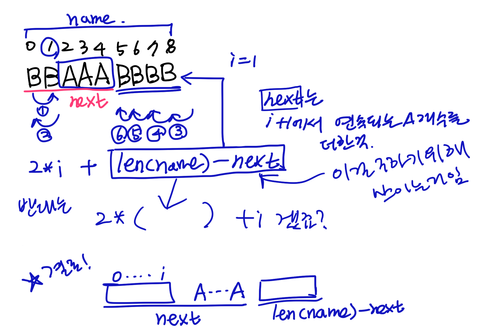

## Info
Programmers - 조이스틱 https://school.programmers.co.kr/learn/courses/30/lessons/42860

## How to solve
아스키코드를 이용해 상하이동 횟수 구함
move의 default값은 len(name)-1

보통 연속된 A가 존재할때 move의 최솟값이 결정됨
2*i + name_cnt - next : 왼쪽방향으로 움직일때 move횟수
2*(name_cnt - next)+i : 오른쪽방향으로 움직일때 move횟수

비교해서 제일 적은 move를 도출

## etc
상하이동은 겁나쉬웟는데 move이동개수세기가 개빡쎗다
파이썬에서 아스키코드 첨 다뤄봄
ord랑 chr 기억해둬야지